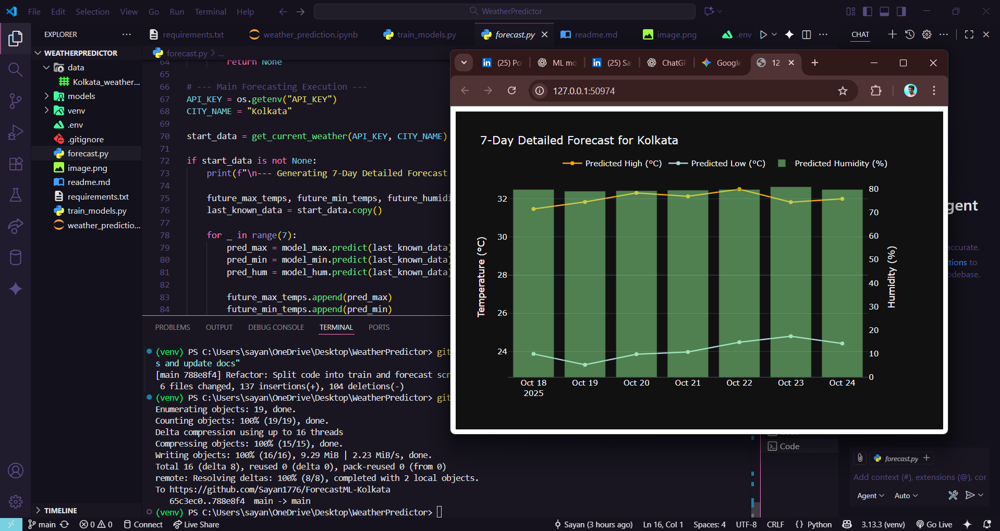

7-Day Weather Forecast Predictor for Kolkata

Overview

    This project is a machine learning application that predicts a detailed 7-day weather forecast for Kolkata. It fetches live, real-time weather data and uses a set of pre-trained models to forecast the maximum temperature, minimum temperature, and relative humidity.

    The project is structured following professional data science practices, separating the model training process from the live forecasting logic.

Features

    Multi-Output Predictions: Forecasts three key weather variables:

    Maximum Daily Temperature (°C)

    Minimum Daily Temperature (°C)

    Relative Humidity (%)

    Live Data Integration: Uses the OpenWeatherMap API to get up-to-the-minute weather data as a starting point for the forecast.

    Advanced ML Model: Employs RandomForestRegressor, a powerful model that captures complex weather patterns more accurately than simple linear models.

    Seasonality Awareness: Feature engineering includes the "day of the year" to help the model understand seasonal weather changes.

    Interactive Visualization: Generates a clean, interactive forecast plot using Plotly.

    Efficient Workflow: Models are trained once and saved, allowing for fast, daily forecasts without the need for re-training.

Technology Stack

    Language: Python 3

    Core Libraries:

        pandas for data manipulation

        scikit-learn for machine learning models

        joblib for saving and loading trained models

    API & Visualization:

        requests for making API calls

        plotly for creating interactive charts

    Data Source: Historical weather data for Kolkata from Kaggle.

File Structure

    WeatherPredictor/
    ├── data/
    │   └── Kolkata_weather_data(2017-2022).csv
    ├── models/
    │   ├── model_humidity.joblib
    │   ├── model_max_temp.joblib
    │   └── model_min_temp.joblib
    ├── train_models.py
    ├── forecast.py
    ├── requirements.txt
    └── README.md

Setup and Installation

    Follow these steps to set up and run the project on your local machine.

    1. Clone the Repository (or prepare your folder)

    2. Create a Virtual Environment

        It's highly recommended to use a virtual environment to keep project dependencies isolated.

        # Navigate to the project directory
        cd WeatherPredictor

        # Create the virtual environment
        python -m venv venv

        # Activate it
        # On Windows:
        venv\Scripts\activate
        # On macOS/Linux:
        source venv/bin/activate

    3. Install Dependencies

        Install all the necessary Python libraries using the requirements.txt file.

        pip install -r requirements.txt

    4. Get Your API Key

        This project requires a free API key from OpenWeatherMap to fetch live weather data.

        Sign up for a free account at OpenWeatherMap.

        Navigate to the "API keys" tab in your account dashboard.

        Copy your default API key.

        Open the forecast.py file and paste your key into the API_KEY variable.

How to Use

The project uses a two-step process: you train the models once, and then you can generate forecasts anytime.

Step 1: Train the Models

    Run the training script from your terminal. This will process the historical data and save the three trained models into the /models directory.

    python train_models.py

    Note: You only need to run this script once.

Step 2: Generate a Forecast

    Run the forecast script. This will load the saved models, fetch live weather data, and display the 7-day forecast plot.

    python forecast.py

    You can run this script anytime you want an updated forecast.

How It Works

    Training: The train_models.py script uses historical weather data from Kolkata_weather_history.csv. It trains three separate RandomForestRegressor models to predict the next day's max_temp, min_temp, and humidity based on the current day's values and the day of the year. The trained models are then saved as .joblib files.

    Forecasting: The forecast.py script loads these pre-trained models. It calls the OpenWeatherMap API to get the current 24-hour weather conditions for Kolkata. This live data is used as the input for the first prediction. The script then iteratively predicts the next 7 days, using each day's prediction as the input for the following day.

    Visualization: The final forecast data is plotted on an interactive graph using Plotly, which is automatically opened in a browser window.